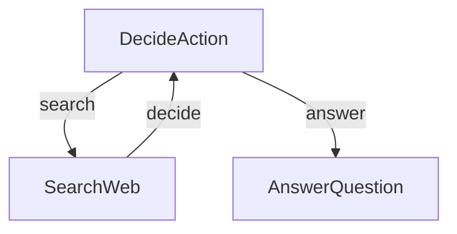

# Google Trends 采集项目

## 项目简介
本项目是一个基于 Python 和 Playwright 的 Google Trends 数据采集工具，并且支持对热点词进行google搜索进行LLM深度解读

- 执行网络搜索以收集信息
- 决定何时搜索与何时回答
- 根据研究结果生成全面的答案

## 功能特性
~~- 动态设置和保存 `COOKIE_STRING` 到 `.env` 文件
- 支持日志记录和实时日志查看
- 自动下载并保存 Google Trends 页面中的热词图片
- 使用 Docker 进行容器化部署~~
- 
## 它是如何工作的？

魔法通过一个简单但强大的图结构发生，该结构包含三个主要部分：



以下是每个部分的作用：
1. **DecideAction**：决定是搜索还是回答的大脑
2. **SearchWeb**：出去寻找信息的研究员
3. **AnswerQuestion**：撰写最终答案的作家

## 快速开始

## 部署

### docker build 镜像

```
   docker build -t google-trends .
```

### docker compose 本地启动

#### 配置修改

- PROXY_URL:修改代理服务器地址

#### 修改volumes配置

E:/Service/docker-volumes为你自己的本地目录

```
    volumes:
      - E:/Service/docker-volumes/logs:/app/logs
      - E:/Service/docker-volumes/tasks:/app/tasks
    environment:
      - HEADLESS=true
      - LOG_LEVEL=INFO
      - PLATFORM=server
      - PROXY_URL=http://127.0.0.1:10809
    command: python main.py --port 7863
```

#### 启动命令

```
    docker compose up -d
```