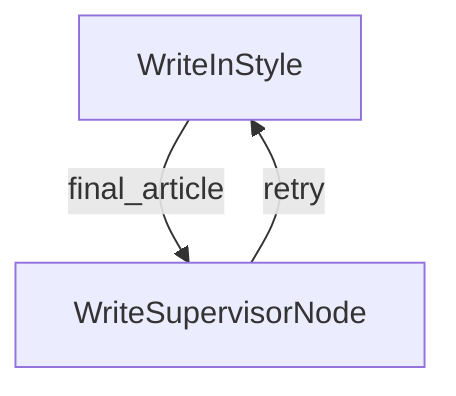

# Google Trends 时下热词叙事风格撰写

## 项目简介
本项目是一个基于 Python 和 Playwright 的 Google Trends 时下热词采集、搜索、叙事撰写、叙事配图评分、叙事撰写（人设测试）工具。
支持本地模型与云端模型。本地模型（多模态）基于gemma3，云模型（多模态）基于deepseek-ai/deepseek-vl2

## 流程

热点->深度查询->叙事->叙事配图->配图评分->叙事撰写（人设测试）

## 系统截图


## 它是如何工作的？

深度搜索工作流：research_hot_word_flow
节点说明：
- DecideAction：决策节点，判断是否继续深度搜索，如果继续则继续深度搜索，如果结束则结束深度搜索
- SearchWeb：网页搜索（热词相关文本及图片）
- AnswerEditor：根据最终结果进行LLM写初稿
- SupervisorNode：对初稿内容进行审核
- EvaluateImage：评估符合热词叙事的配图，对图片进行多维度评分

```mermaid
graph TD
    A[DecideAction] -->|"search"| B[SearchWeb]
    A -->|"answer"| C[AnswerEditor]
    B -->|"decide"| A
    C --> D[SupervisorNode]
    D --> |"approved |E[EvaluateImage]
    D --> |"retry"| A
    
```

风格撰写工作流：write_in_style_flow
节点说明：
- WriteInStyle：根据不同的风格Prompt，结合初稿进行LLM写最终稿
- WriteSupervisorNode：对初稿内容进行审核



## 快速开始

## 部署

### docker build 镜像

```
   docker build -t google-trends .
```

### docker compose 本地启动

#### 配置修改

- PROXY_URL:修改代理服务器地址

#### 修改volumes配置

E:/Service/docker-volumes为你自己的本地目录

```
    volumes:
      - D:/Service/docker-volumes/google-trends/logs:/app/logs
      - D:/Service/docker-volumes/google-trends/tasks:/assets/tasks
      - D:/Service/docker-volumes/google-trends/zip:/assets/zip
    environment:
      - ZIP_DIR=/assets/zip
      - TASK_DIR=/assets/tasks
      - LOCAL_LLM_URL=http://192.168.31.85:11434/api/generate
      - CLOUD_API_KEY=
      - LOCAL_MODEL_NAME=gemma3
      - LOG_LEVEL=INFO
      - PLATFORM=server
      - PROXY_URL=http://192.168.31.85:10811
      - SERPER_API_KEY=
```

#### 启动命令

```
    docker compose up -d
```

