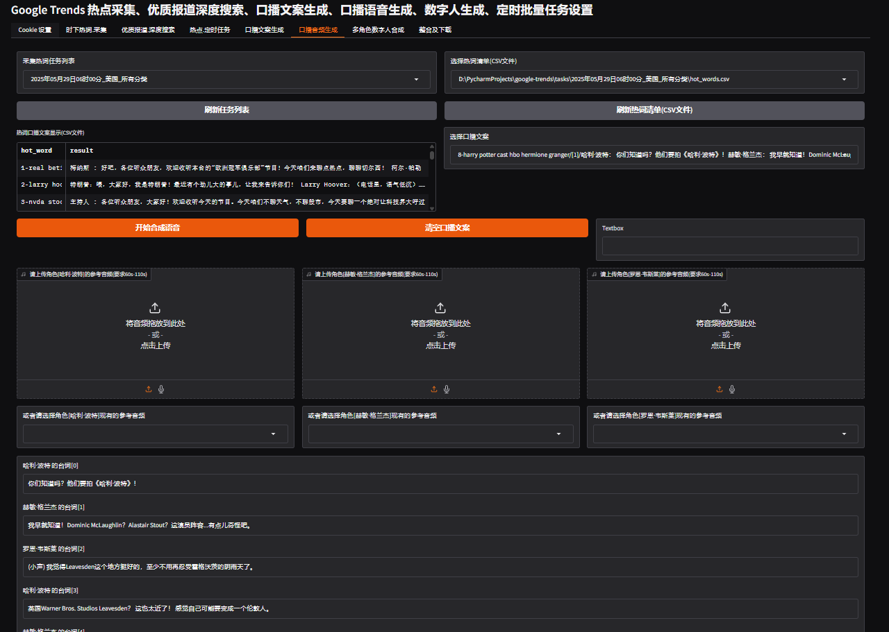
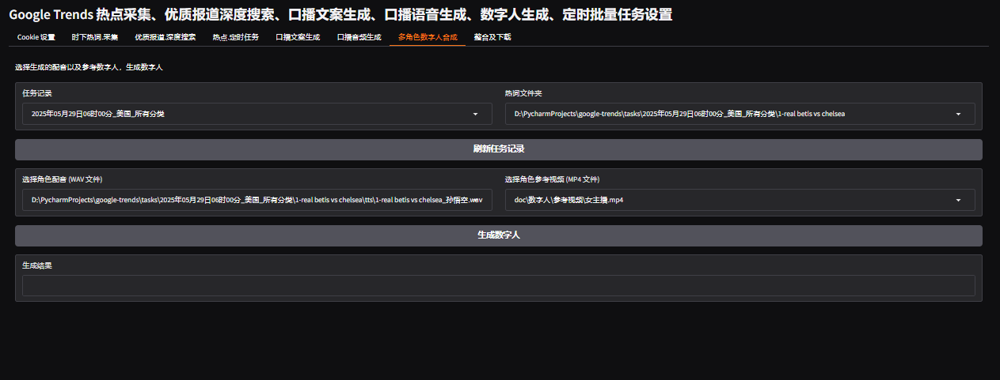

# 🌟 Google Trends 时下热点追踪Agent

| 媒体类别     | 截图                                      | 视频链接                                                                 | 媒体类别     | 截图                                        | 视频链接                                                                 |
|----------|-----------------------------------------|--------------------------------------------------------------------------|----------|-------------------------------------------|--------------------------------------------------------------------------|
| 图文口播视频   |  | [点击查看](https://www.bilibili.com/video/BV1pDjrz7ExF) | 支持英文 |      | [点击查看](https://www.bilibili.com/video/BV1i1j9zuE59) |
| 数字人      |   | [点击查看](https://www.bilibili.com/video/BV197EBzFESq) | 多人对话     |  | [点击查看](https://www.bilibili.com/video/BV1Am5Kz1ESB) |

## 📌 项目简介

本项目是一个基于[pocketflow](https://github.com/The-Pocket/PocketFlow)) 设计的 **时下热词追踪Agent** 💡  
集成多 Tools、TTS、ASR、HeyGem API 实现以下核心能力：

- 🔍 热点叙事的深度搜索
- 🖼️ 热点的配图采集
- 📰 热点转图文
- 🎤 热点转多角色语音播报（支持多角色参考音频）
- 🧑‍💻 数字人视频生成
- 📄 字幕生成
- ⏰ 定时任务自动执行

多媒体分发：

- Markdown图文 [查看效果](doc/示例/19-bryce%20harper_简体中文.md)
- 图片 [查看效果](doc/示例/19-bryce%20harper_简体中文_简体中文.png)
- 静态HTML页面 [查看效果，下载后,浏览器打开](doc/示例/19-bryce%20harper_简体中文_简体中文.html)
- Notion API同步 [查看效果](https://www.funfox.icu/%E7%83%AD%E7%82%B9%E8%BF%BD%E8%B8%AA/2018ae0b-aa5f-8133-b07b-fb4e5a614fb8)


后续将持续完善更多功能，敬请期待！🎉

---
## 🧠 模型支持

我们支持 **本地模型** 和 **云端模型**，灵活适配不同场景需求：

- **本地模型（多模态）**：基于 `gemma3`（4b/12b/27b）
- **云端模型（多模态）**：基于 `deepseek-ai/deepseek-vl2`

---


## 🎥 媒体画廊


## 🚀 快速开始

## 🛠️ 部署步骤

```commandline

git https://github.com/Fun-Fox/google-trends.git
cd google-trends
git submodule update --init --recursive

# 创建虚拟环境

conda create -n google-trends python=11
conda activate google-trends
pip install -r requirements.txt

# 下载网页采集依赖

playwright install chromium
conda  install ffmpeg
cd index-tts
pip install -r requirements.txt
set HF_ENDPOINT=https://hf-mirror.com

# 下载index-tts模型文件

huggingface-cli download IndexTeam/Index-TTS bigvgan_discriminator.pth bigvgan_generator.pth bpe.model dvae.pth gpt.pth unigram_12000.vocab --local-dir checkpoints

# 下载fast-whisper模型文件

cd ..
huggingface-cli download --repo-type model deepdml/faster-distil-whisper-large-v3.5 --local-dir models/faster-distil-whisper-large-v3.5

# 部署heygem数字人 Docker 容器服务

cd heygem/deploy
docker compose up -f  docker-compose-lite.yml up -d


```
# 启动项目

python start.py

## 🛠️ 项目配置

将项目下的.env_example 复制为 .env，按描述修改.env文件

### ✅ 必填项：
- PROXY_URL :代理配置
- SERPAPI_API_KEY ：[注册地址](https://serper.dev/) 注册就有2000的额度，可以用很久
> 本地模型或云端模型只需要填一种即可
- LOCAL_LLM_URL、LOCAL_MODEL_NAME： 本地模型接入配置
- CLOUD_API_KEY、CLOUD_MODEL_NAME ：云端模型配置接入配置 [注册地址](https://api.siliconflow.cn)

### 📎 选填项：

- HEY_GEN_IP：Heygem数字人服务IP地址，如果使用docker部署，则填写当前宿主机的IP地址
- IMGUR_CLIENT_ID、IMGUR_CLIENT_SECRET： 图床服务地址，用于notion图片上传 [注册地址](https://api.imgur.com/oauth2/addclient)
- NOTION_API_KEY、DATABASE_ID：Notion数据库配置，用于api同步 [注册地址](https://developers.notion.com/docs/create-a-notion-integration)

##  📈 开发计划

| 功能             | 状态      |
|----------------|---------|
| 时下热词采集         | [x] 已完成 ✅ |
| 深度搜索           | [x] 已完成 ✅ |
| 口播文案           | [x] 已完成 ✅ |
| 定制口播提示词        | [x] 已完成 ✅ |
| 集成 TTS           | [x] 已完成 ✅ |
| 多角色口播音频生成     | [x] 已完成 ✅ |
| 集成 HeyGen 数字人 API | [x] 已完成 ✅ |
| 完善定时任务         | [x] 已完成 ✅ |
| 批量操作优化         | [x] 已完成 ✅ |
| 自动同步 Notion 页面   | [x] 已完成 ✅ |

## 🖥️ 系统运行截图及流程示例

| 功能名称       | 描述信息                                                                 | 配图示意                                      |
|----------------|--------------------------------------------------------------------------|-----------------------------------------------|
| 时下热词采集   | 采集 Google Trends 全球不同地区、分类的热词数据，并下载推荐新闻热图      |                            |
| 深度搜索       | 网络搜索决策者决定是否继续深度搜索，最终获取满足要求的结果                |                            |
| 口播文案       | 在界面选择热词并设置叙事提示词，进行人设测试                              |                            |
| 口播音频       | 支持多角色各自独立音频轨道生成                                          |                            |
| 多角色数字人   | 多个角色的数字人合成视频生成                                            |                            |
| 定时任务       | 支持定时执行任务流程                                                    |                            |
| 素材下载       | 下载热词相关的初稿及素材，并对图片进行评分（与内容相关性）                |                            |

## 🧩 它是如何工作的？

### 深度搜索工作流：[deepsearch_flow](file://D:\PycharmProjects\google-trends\agent\flow\deepsearch_flow.py#L0-L0)


节点说明：

- [DecideAction](file://D:\PycharmProjects\google-trends\agent\nodes\deepsearch.py#L18-L147)：判断是否继续深度搜索
- [SearchWeb](file://D:\PycharmProjects\google-trends\agent\nodes\deepsearch.py#L150-L245)：网页搜索（文本 + 图片）
- [ContentSummarizer](file://D:\PycharmProjects\google-trends\agent\nodes\summarizer.py#L17-L152)：LLM 写初稿
- [SupervisorNode](file://D:\PycharmProjects\google-trends\agent\nodes\summarizer.py#L156-L273)：审核初稿内容
- `EvaluateImage`：评估图片与内容的相关性

tool说明：

- crawler：深度采集页面
- summary：生成报告


### 🎨 内容风格撰写工作流：[content_flow](file://D:\PycharmProjects\google-trends\agent\flow\content_flow.py#L0-L0)


节点说明：


- [ContentParaphraser](file://D:\PycharmProjects\google-trends\agent\nodes\paraphraser.py#L8-L59)：根据风格 Prompt 调整叙事风格
- [WriteSupervisorNode](file://D:\PycharmProjects\google-trends\agent\nodes\paraphraser.py#L62-L102)：内容校验节点


### 🧾 提示词模板示例

####  🤖 DecideAction（深度搜索决策节点）

```
你是一个可以搜索网络的热点新闻深度搜索助手
现在给你一个时下网络流行热词，你需要参考查询维度、先前的研究进行深度搜索，深度思考并理解该热词对应的叙事内容。
使用{language}回答
### 查询维度

- 事件基本信息 : 确认热词对应的具体事件、时间、地点、主要人物
- 事件发展脉络 : 事件起因、关键节点、最新进展
- 社会影响范围 : 受众群体、地域影响、行业影响
- 争议焦点 : 各方观点分歧、争论核心问题
- 官方回应 : 相关权威机构/人物的正式表态
- 关联事件 : 与此热点相关的历史/并行事件

并非所有查询条件都需满足，可使用优先级进行排序
查询优先级：事件基本信息>事件发展脉络>社会影响范围>争议焦点>官方回应>关联事件

## 上下文
- 当前时间: {current_date}
- 时下流行热词: {hot_word}
{desc}
- 相关新闻报导标题：

{relation_news}

- 先前的研究,总计为{links_count}条,具体如下：

{context}

## 操作空间
[1] search
  描述: 在网络上查找更多信息
  参数:
    - query (str): 搜索内容

[2] answer
  描述: 用当前知识回答问题
  参数:
    - answer (str): 问题的最终回答

### 下一步操作
根据上下文、查询维度和可用操作决定下一步操作。
重要：请确保：
如先前的研究，总计大于6条，则结合已有的研究进行回答操作，不再进行深度搜索，

请以以下格式返回你的响应：


thinking: |
    <你的逐步推理过程>
action: search OR answer
reason: <为什么选择这个操作>
answer: <如果操作是回答>
search_query: <具体的搜索查询如果操作是搜索>

重要：请确保：

如先前的研究，总计大于6条，则结合已有的研究进行回答操作，不再进行深度搜索，
1. 使用|字符表示多行文本字段
2. 多行字段使用缩进（4个空格）
3. 单行字段不使用|字符
4. 不允许直接在键后嵌套另一个键（如 answer: search_query:)
5. 非键值对不允许随意使用冒号: 
       
```

#### 🧮 ContentSummarizer（输出总结节点）

```
    
你是一个热点信息精炼助手，基于以下信息，回答问题。

### 精炼维度

- 核心事实提取: 从海量信息中提取关键事实要素
- 舆情脉络梳理: 梳理公众情绪变化与讨论焦点转移路径
- 发酵点识别: 识别推动话题扩散的关键节点与触发因素
- 趋势预判: 基于现有信息预测话题可能的发展方向

### 输入格式:

当前时间: {current_date}
时下流行热词: {hot_word}

{hot_word_info}

内容描述: 

{context}

相关搜索历史:

{search_history}

### 你的回答:
1. 请根据研究内容撰写如下两部分叙事文案：
   - 中文叙事 (`chinese`)
   - {language}叙事 (`output`)
   - 内容要求：
     * 使用日常语言，避免术语
     * 涵盖核心事实、舆情脉络、发酵点及趋势预判等维度
     * 每段保持结构清晰，逻辑通顺

2. 同时，请从研究内容中提取 **2个最相关的优质报道摘要**，并返回以下结构：


highlights: 
  - title: <报道标题1,使用{language}> 
    summary: <摘要,使用{language}> 
    link: "<来源链接,链接使用引号>"
  - title: <报道标题2,使用{language}> 
    summary: <摘要,使用{language}> 
    link: "<来源链接,链接使用引号>"
chinese: |
    <中文叙事文案>
output: |
    <{language}叙事文案,注意此部分文案使用{language}>


重要：请确保：
⚠️ YAML 格式要求：
- 所有字段使用英文冒号 `:` + **一个空格** 开始值
- 多行字段使用 `|` 表示，并至少比键名多一级缩进（推荐 4 个空格）
- 列表项（`-`）需统一缩进
- 不允许在 `title:`、`summary:`、`link:` 后直接嵌套新结构
- 避免使用中文冒号 `：` 或省略空格
- 不要对 `chinese` 和 `output` 字段进行嵌套或添加额外结构
```

#### 📊 EvaluateImage（配图评分节点）

```
    
    ## 上下文
    你是一个内容配图评分助手

    ## 操作空间
    请根据以下指标对内容的配图进行评分
    内容：{draft}

    评分指标（每个指标1-10分 整数）：
    - 相关性：图片是否与文章内容相关。
    - 吸引力：图片是否能吸引用户眼球。
    - 视觉效果：图片的色彩、构图和清晰度如何。
    - 情感共鸣：图片是否能引发观众的情感共鸣。

    ## 下一步操作
    请以下格式返回你的响应,无需其余信息：

    ```yaml
    total_score: <总分>
    relevance: <相关性-指标分数>
    attractiveness: <吸引力-指标分数>
    visual: <视觉效果-指标分数>
    emotional: <情感共鸣-指标分数>
    ```
    
    重要：请确保：
    1. 对所有多行字段使用适当的缩进（4个空格）
    2. 使用|字符表示多行文本字段
    3. 保持单行字段不使用|字符
    4. 正确使用YAML字符串格式
    
```

> 更多细节请查看完整代码仓库 👀
---

🚀 本项目持续更新中，敬请关注 GitHub 最新动态！


