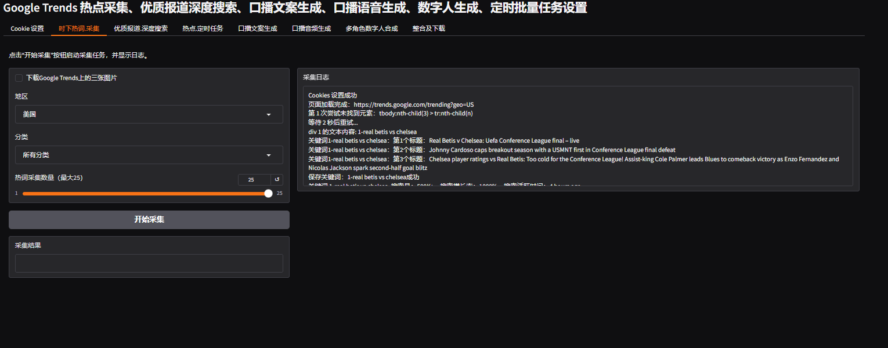

# Google Trends 时下热词叙事风格撰写

## 项目简介

本项目是一个基于Playwright(网页自动化)、pocketflow(Agent框架) 的 Google Trends 时下热词采集、搜索、叙事撰写、叙事配图评分、叙事撰写（人设测试）工具。
支持本地模型与云端模型。本地模型（多模态）基于gemma3，云模型（多模态）基于deepseek-ai/deepseek-vl2

## 流程

热点->深度查询->叙事->叙事配图->配图评分->叙事撰写（人设测试）

## 系统运行截图及过程例子

### 时下热词采集
采集google trends 全球不同地区不同分类的热词数据，并且还可以下载推荐的新闻热图



### 深度搜索
由网络搜索决策者，决定进行深度搜索，最终则到满足要求的结果


可以查看样例日志文件，查看最近完整执行过程
[agent执行日志文件](doc/agent执行过程-样例.log)

### 人设测试
这部分可以在界面上选择时下热词-叙事自定义提示词，进行人设设置，然后进行测试


### 素材下载
可以下载时下热词，并且还有搜索后的初稿以及素材下载，并且对图片进行的评分(与内容相关性的评分)


## 它是如何工作的？

#### 深度搜索工作流：research_hot_word_flow

节点说明：

- DecideAction：决策节点，判断是否继续深度搜索，如果继续则继续深度搜索，如果结束则结束深度搜索
- SearchWeb：网页搜索（热词相关文本及图片）
- AnswerEditor：根据最终结果进行LLM写初稿
- SupervisorNode：对初稿内容进行审核
- EvaluateImage：评估符合热词叙事的配图，对图片进行多维度评分


#### 提示词

> DecideAction

```
    f"""
    ## 上下文
    
    你是一个可以搜索网络的热点新闻深度查询助手
    现在给你一个时下网络流行热词，你需要进行深度查询，确保最终理解并能够全面的回答该热词对应的叙事内容。
    
    ### 查询维度
    
    - 发生时间：最近48小时内
    - 事件基本信息 : 确认热词对应的具体事件、时间、地点、主要人物
    - 事件发展脉络 : 事件起因、关键节点、最新进展
    - 社会影响范围 : 受众群体、地域影响、行业影响
    - 争议焦点 : 各方观点分歧、争论核心问题
    - 官方回应 : 相关权威机构/人物的正式表态
    - 公众反应 : 主流情绪倾向、典型评论
    - 专业解读 : 权威专家/媒体的分析观点
    - 传播特点 : 传播路径、关键推手、发酵速度
    - 关联事件 : 与此热点相关的历史/并行事件
    
    ### 输入
    时下流行热词: {hot_word}
    先前的研究: 
    {context}
    
    ## 操作空间
    [1] search
      描述: 在网络上查找更多信息
      参数:
        - query (str): 搜索内容
    
    [2] answer
      描述: 用当前知识回答问题
      参数:
        - answer (str): 问题的最终回答
    
    ### 下一步操作
    根据上下文、查询维度和可用操作决定下一步操作。
    请以以下格式返回你的响应：
    
    ```yaml
    thinking: |
        <你的逐步推理过程>
    action: search OR answer
    reason: <为什么选择这个操作>
    answer: <如果操作是回答>
    search_query: <具体的搜索查询如果操作是搜索>
    ```
    重要：请确保：
    
    1. 使用|字符表示多行文本字段
       2. 多行字段使用缩进（4个空格）
       3. 单行字段不使用|字符
       4. 不允许直接在键后嵌套另一个键（如 answer: search_query:)
       """
```

> AnswerEditor

```
    f"""
    ## 上下文
    
    你是一个热点信息精炼助手，基于以下信息，回答问题。
    
    ### 精炼维度
    
    - 核心事实提取: 从海量信息中提取关键事实要素
      - 舆情脉络梳理: 梳理公众情绪变化与讨论焦点转移路径
      - 发酵点识别: 识别推动话题扩散的关键节点与触发因素
      - 趋势预判: 基于现有信息预测话题可能的发展方向
    
    ### 输入格式:
    
    时下网络流行热词: {hot_word}
    研究: 
    {context}
    
    ### 你的回答:
    结合热词对应的研究进行理解，
    - 使用精炼维度撰写叙事文案
      - 使用中文和英文。
      - 用简单易懂的语言解释想法
      - 使用日常语言，避免术语
            
    请以以下格式返回你的响应：
    
    ```yaml
    chinese: |
        <中文叙事文案>
    english: |
        <英文叙事文案>
    ```

    重要：请确保：
    1. 使用|字符表示多行文本字段
    2. 多行字段使用缩进（4个空格）
    3. 单行字段不使用|字符
    """
```

> EvaluateImage

```
    f"""
    ## 上下文
    你是一个内容配图评分助手

    ## 操作空间
    请根据以下指标对内容的配图进行评分
    内容：{draft}

    评分指标（每个指标1-10分 整数）：
    - 相关性：图片是否与文章内容相关。
    - 吸引力：图片是否能吸引用户眼球。
    - 视觉效果：图片的色彩、构图和清晰度如何。
    - 情感共鸣：图片是否能引发观众的情感共鸣。

    ## 下一步操作
    请以下格式返回你的响应,无需其余信息：

    ```yaml
    total_score: <总分>
    relevance: <相关性-指标分数>
    attractiveness: <吸引力-指标分数>
    visual: <视觉效果-指标分数>
    emotional: <情感共鸣-指标分数>
    ```
    
    重要：请确保：
    1. 对所有多行字段使用适当的缩进（4个空格）
    2. 使用|字符表示多行文本字段
    3. 保持单行字段不使用|字符
    4. 正确使用YAML字符串格式
    """
```

### 风格撰写工作流：write_in_style_flow

节点说明：

- WriteInStyle：根据不同的风格Prompt，结合初稿进行LLM写最终稿
- WriteSupervisorNode：对初稿内容进行审核


#### 提示词

这部分可以在界面上选择时下热词-叙事自定义提示词，进行人设设置，然后进行测试

## 快速开始

## 部署

### docker build 镜像

```
   docker build -t google-trends .
```

### docker compose 本地启动

#### 配置修改

- PROXY_URL:修改代理服务器地址

#### 修改volumes配置

E:/Service/docker-volumes为你自己的本地目录

```
    volumes:
      - D:/Service/docker-volumes/google-trends/logs:/app/logs
      - D:/Service/docker-volumes/google-trends/tasks:/assets/tasks
      - D:/Service/docker-volumes/google-trends/zip:/assets/zip
    environment:
      - ZIP_DIR=/assets/zip
      - TASK_DIR=/assets/tasks
      - LOCAL_LLM_URL=http://<本地ip>:11434/api/generate
      - CLOUD_API_KEY=
      - LOCAL_MODEL_NAME=gemma3
      - LOG_LEVEL=INFO
      - PLATFORM=server
      - PROXY_URL=
      - SERPER_API_KEY=
```

#### 启动命令

```
    docker compose up -d
```

