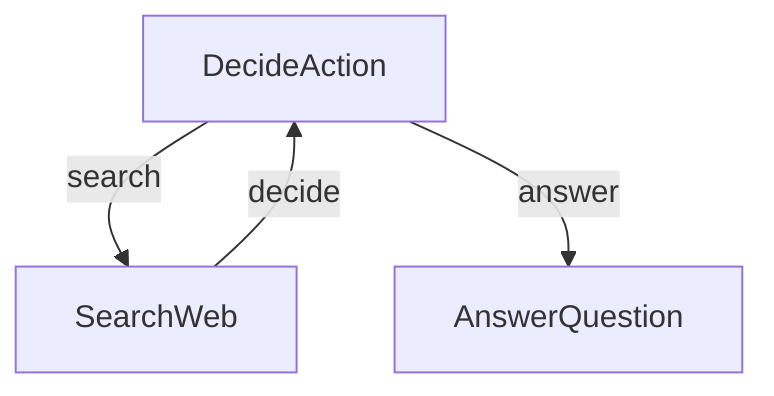

## 功能

- 执行网络搜索以收集信息
- 决定何时搜索与何时回答
- 根据研究结果生成全面的答案

## 快速开始

1. 使用以下简单命令安装所需的包：
```bash
pip install -r requirements.txt
```

2. 让我们准备好您的SERPER_API_KEY API密钥：

```bash
export SERPER_API_KEY="your-api-key-here"
```

3. 让我们进行快速检查，确保您的API密钥正常工作：

```bash
python utils.py
```

这将测试LLM调用和网络搜索功能。如果您看到响应，您就可以开始了！

4. 使用默认问题（关于诺贝尔奖得主）试用代理：

```bash
python main.py
```

5. 有紧急问题吗？使用`--`前缀提问任何您想问的问题：

```bash
python main.py --"What is quantum computing?"
```

## 它是如何工作的？

魔法通过一个简单但强大的图结构发生，该结构包含三个主要部分：



以下是每个部分的作用：
1. **DecideAction**：决定是搜索还是回答的大脑
2. **SearchWeb**：出去寻找信息的研究员
3. **AnswerQuestion**：撰写最终答案的作家

以下是每个文件的内容：
- [`main.py`](./main.py): 起点 - 运行整个程序！
- [`flow.py`](./flow.py): 将所有内容连接在一起形成智能代理
- [`nodes.py`](./nodes.py): 作出决策并采取行动的构建块
- [`utils.py`](./utils.py): 用于与LLM对话和搜索网络的辅助函数
